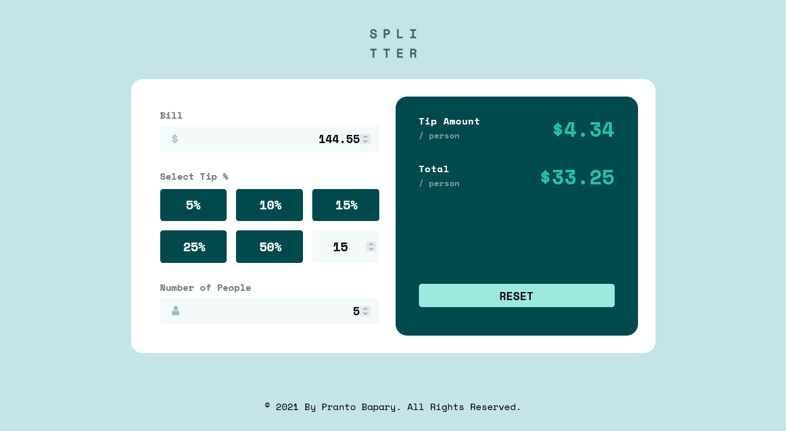
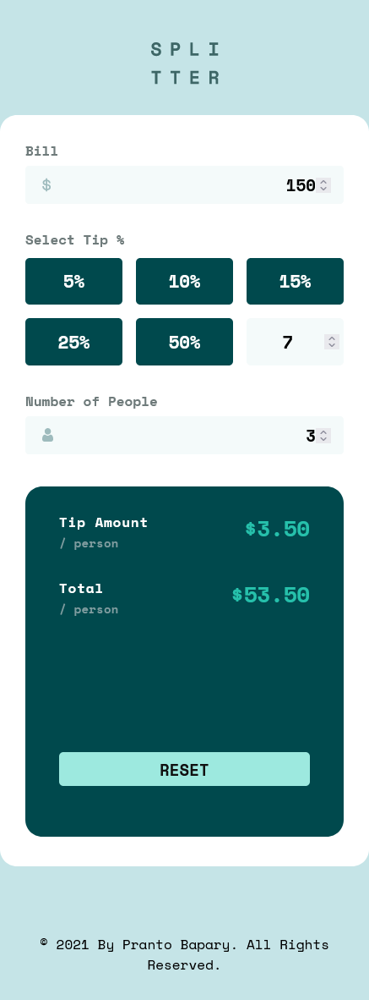

# Frontend Mentor - Tip calculator app solution

This is a solution to the [Tip calculator app challenge on Frontend Mentor](https://www.frontendmentor.io/challenges/tip-calculator-app-ugJNGbJUX). Frontend Mentor challenges help you improve your coding skills by building realistic projects.

## Table of contents

- [Overview](#overview)
  - [The challenge](#the-challenge)
  - [Screenshot](#screenshot)
  - [Links](#links)
  - [Built with](#built-with)
  - [What I learned](#what-i-learned)
  - [Useful resources](#useful-resources)
- [Author](#author)

## Overview

I found this challenge on frontendmentor.io and then tried this to test my CSS and JavaScript skills.

### The challenge

Users should be able to:

- View the optimal layout for the app depending on their device's screen size
- See hover states for all interactive elements on the page
- Calculate the correct tip and total cost of the bill per person

### Screenshot

### Links

- Solution URL: [Github](https://github.com/Pranto-Bapary/tip-calculator)
- Live Site URL: [Github Pages](https://pranto-bapary.github.io/tip-calculator/)

### Built with

- HTML5
- CSS3
- Flexbox
- CSS Grid
- Mobile-first workflow
- [Google Fonts](https://fonts.google.com/) - For Fonts

### What I learned

By creating this project I grasped a good knowledge about CSS Grid,Flexbox,Responsive Design and also learned JavaScript DOM Manipulation,Form Validation and how to handle errors.

### Useful resources

- [W3schools](https://www.w3schools.com/) - This resource helped me for learning Web Development. I really encourage everyone to have a look at their website for learning Web Development from the beginning.

## Author

- Github - [pranto-bapary](https://github.com/pranto-bapary)
- Frontend Mentor - [@apranto-bapary](https://www.frontendmentor.io/profile/pranto-bapary)
